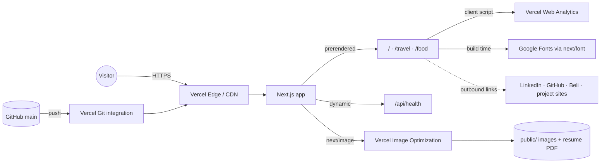

# Architecture

A static-first Next.js App Router site on Vercel. There is no database, auth, or backend of its own.

## External services

| Service                    | Used for                                 | Failure impact                              |
| -------------------------- | ---------------------------------------- | ------------------------------------------- |
| Vercel hosting + CDN       | Serving the site, image optimization     | Site down                                   |
| Vercel Web Analytics       | Page views and `track()` click events    | None for visitors; analytics gap            |
| Google Fonts (`next/font`) | Jersey 10 font, downloaded at build time | Build fails if unreachable; no runtime call |
| GitHub                     | Source and deploy trigger                | No new deploys                              |

## Request flow

1. Pages are prerendered at build time. Vercel serves them from the CDN.
2. Client components (`PortfolioTree`, the galleries) hydrate and run the theme toggle (`next-themes`, stored in `localStorage`). There is no load-in animation; content is visible on first paint.
3. Link clicks call `track()`, which sends an anonymous event to Vercel Analytics.
4. `/api/health` is the only dynamic route. It returns `{ status, commit }` for uptime checks.

## Home page: server shell, data-driven tree

`app/page.tsx` is a server component; interactivity lives in client islands
(`PortfolioTree`, `ButtonsRow`, `ThemeToggle`).

- The tree is data-driven: `components/portfolio-tree-data.tsx` holds a typed
  `TreeNode` array (folders and files) rendered recursively by
  `components/PortfolioTree.tsx`.
- Expansion state is controlled and persisted in `localStorage` under the key
  `portfolio-tree-state` (`{ expanded: string[], allExpanded: boolean }`).
  `lib/tree-state.ts` reads/writes it, `lib/use-tree-state.ts` exposes it to
  React, and `components/TreeStateProvider.tsx` shares it between the tree and
  the expand-all toggle. The server render uses the default expansion
  (`evan mavis/` + the job-title folder); the stored state is applied on mount,
  so reloads and gallery round-trips restore the exact tree.

## Icons: bundled at build time

The site makes no runtime requests to api.iconify.design. `lib/tech-icons.tsx`
(`getTechIcon(name)`) renders inline SVGs from `lib/icons-generated.ts`, a
generated module of SVG bodies built by `scripts/generate-icons.mjs` from the
`@iconify-json/*` devDependencies (`@iconify/utils` at build time only).
Brands with no iconify entry (inngest, factory) are hand-authored bodies in the
script. Regenerate with `pnpm run icons:generate`; never edit the generated
file by hand.

## Images

Gallery photos in `public/` are re-compressed in place by
`scripts/optimize-images.mjs` (`pnpm run images:optimize`): sharp re-encodes
any jpg/jpeg/png over ~400 KB to max 2400px long edge, mozjpeg q80, EXIF/GPS
stripped, same filename. Gallery `next/image` elements carry explicit
width/height and `sizes` attributes so layout space is reserved (travel CLS is
0). `next.config.ts` sets a long `minimumCacheTTL` for optimized images.

## Deploys

Every push to `main` triggers a production deploy through the Vercel GitHub integration. Pull requests get preview deploys. CI (`.github/workflows/ci.yml`) runs checks on every pull request and push. See `runbook.md` for rollback.
