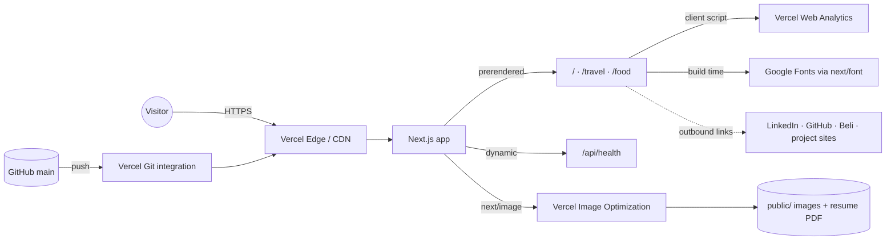

# Architecture

A static-first Next.js App Router site on Vercel. There is no database, auth, or backend of its own.

## External services

| Service                    | Used for                                 | Failure impact                              |
| -------------------------- | ---------------------------------------- | ------------------------------------------- |
| Vercel hosting + CDN       | Serving the site, image optimization     | Site down                                   |
| Vercel Web Analytics       | Page views and `track()` click events    | None for visitors; analytics gap            |
| Google Fonts (`next/font`) | Jersey 10 font, downloaded at build time | Build fails if unreachable; no runtime call |
| GitHub                     | Source and deploy trigger                | No new deploys                              |

## Request flow

1. Pages are prerendered at build time. Vercel serves them from the CDN.
2. Client components (`PortfolioTree`, the galleries) hydrate and run the animations and theme toggle (`next-themes`, stored in `localStorage`).
3. Link clicks call `track()`, which sends an anonymous event to Vercel Analytics.
4. `/api/health` is the only dynamic route. It returns `{ status, commit }` for uptime checks.

## Deploys

Every push to `main` triggers a production deploy through the Vercel GitHub integration. Pull requests get preview deploys. CI (`.github/workflows/ci.yml`) runs checks on every pull request and push. See `runbook.md` for rollback.
